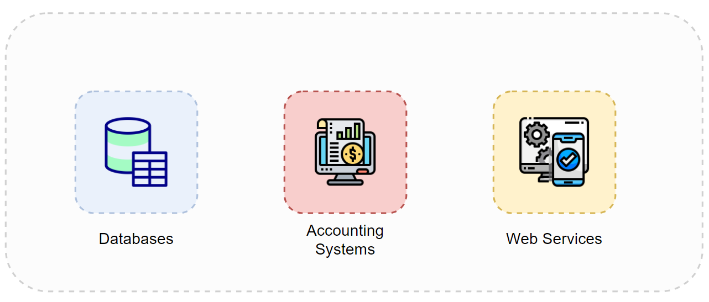
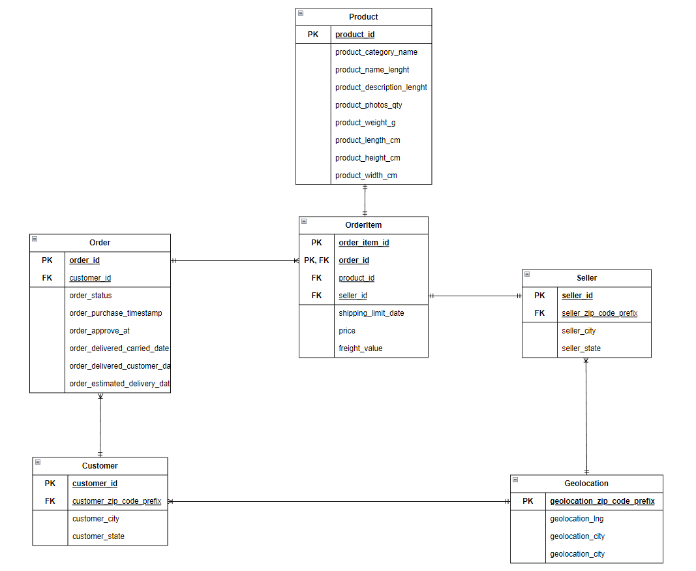
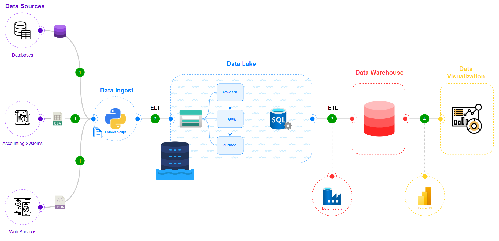
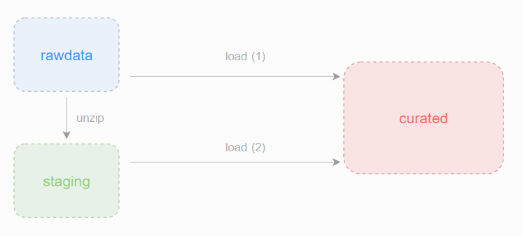

# [Xây Dựng Giải Pháp Business Intelligence Trên Nền Tảng Đám Mây Microsoft Azure Kết Hợp ELT Động](https://github.com/trannhatnguyen2/BI_Cloud_KienTap)

## Member of group

### **`BoKho`**

| student_id | class   | full_name        | role   |
| ---------- | ------- | ---------------- | ------ |
| K204061440 | K20406T | Tran Nhat Nguyen | Leader |
| K204061446 | K20406C | Man Dac Sang     | Member |

# 📕 Table of contents

<!--ts-->

- 🛠️ [Requirements](#️-requirements)
- 🧙‍♂️ [Data Source](#-data-source)
- 🚀 [Solution](#-solution)
- 🌊 [Building Data Lake](#-building-data-lake)
- 🧱 [Building Data Warehouse](#-building-data-warehouse)
- 📊 [Result](#️-result)
- 📂 [Files](#-files)
<!--te-->

 <br />

# 🛠️ Requirements

Many businesses are using multiple systems and data is distributed across multiple sources and formatted in different file types. This leads to difficulties in importing and storing data, and if there are discrepancies, it can lead to many negative consequences such as loss of consistency, unnecessary costs, and impact on the business decision-making process.

# 🧙‍♂️ Data Source

The data was obtained from Kaggle for experimentation. It was divided into three different sources:

<p align="center">


<p align="center">
    Data Sources
</p>

1. `Databases`: recording sales activities on an e-commerce platform in Brazil regarding orders.

<p align="center">


<p align="center">
    ERD model
</p>

2. `Accounting Systems`: recording and managing customer payment information for orders.
3. `Web Services`: customer comments on products and services.

# 🚀 Solution

<p align="center">


<p align="center">
    BI Solution
</p>

- Step 1: Identify data sources and file formats for each source.
- Step 2: Extract data into the `rawdata` zone using a Python script; perform dynamic ELT processes into the "curated" zone to store and upload necessary data for analysis to Azure SQL Server.
- Step 3: Perform ETL processes into the Data Warehouse using Data Factory.
- Step 4: Visualize data using Power BI.

# 🌊 Building Data Lake

## Container

The tool used to create data storage zones on the Azure platform is Blob Storage.

<p align="center">


<p align="center">
    Containers
</p>

### **rawdata**

An exact copy of the data from sources, organized in an orderly folder structure.

```bash
./RAWDATA
├── .accounting_systems/ <- Accounting System Source
│ ├── Payment_2018_01.csv
│ ├── Payment_2018_02.csv
│ └── Payment_2018_03.csv
│
├── .databases/ <- Databases Source
│ ├── Customer_2018_01.csv
│ ├── Customer_2018_02.csv
│ ├── Customer_2018_03.csv
│ ├── Order_2018_01.csv
│ ├── Order_2018_02.csv
│ |── Order_2018_03.csv
| ├── OrderItem_2018_01.csv
│ |── OrderItem_2018_02.csv
│ └── OrderItem_2018_03.csv
│
├── .web_services/ <- Web Services Source
│ ├── Review_2018_01.zip
│ ├── Review_2018_01.zip
│ └── Review_2018_01.zip
```

### **staging**

Used to extract all compressed files to prepare for importing data into the `curated` zone.

### **curated**

```bash
./CURATED
├── .EXTERNAL/
│ ├── .Review/
    ├── .2018/
        ├── .01/
            └── Review_2018_01.json
        ├── .02/
            └── Review_2018_02.json
        ├── .03/
            └── Review_2018_03.json
│
├── .INTERNAL/
│ ├── .Accounting/
    ├── .Payment/
        ├── .2018/
            ├── .01/
                └── Payment_2018_01.csv
            ├── .02/
                └── Payment_2018_02.csv
            ├── .03/
                └── Payment_2018_03.csv
│ ├── .Sales/
    ├── .Customer/
        ├── .2018/
            ├── .01/
                └── Customer_2018_01.csv
            ├── .02/
                └── Customer_2018_02.csv
            ├── .03/
                └── Customer_2018_03.csv
    ├── .Order/
        ├── .2018/
            ├── .01/
                └── Order_2018_01.csv
            ├── .02/
                └── Order_2018_02.csv
            ├── .03/
                └── Order_2018_03.csv
    ├── .OrderItem/
        ├── .2018/
            ├── .01/
                └── OrderItemm_2018_01.csv
            ├── .02/
                └── OrderItemm_2018_02.csv
            ├── .03/
                └── OrderItemm_2018_03.csv
```

# 🧱 Building Data Warehouse
